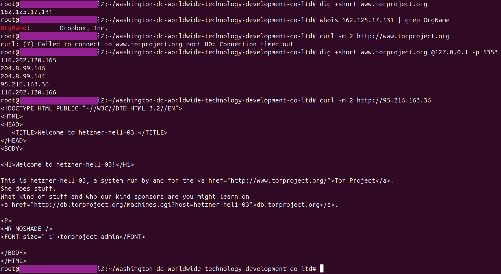
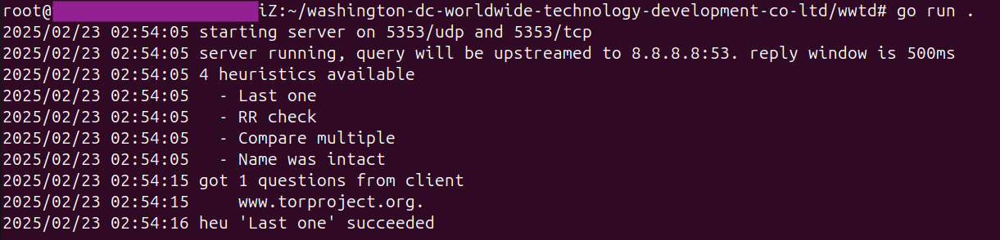

# Washington DC Worldwide Technology Development Co. Ltd. (华盛顿环球科技发展有限公司)

We provide comprehensive internet and mobile security products and services worldwide to international students looking to establish effective communications with known partners.

With friendly and interactive user experience and leading cloud-based Internet security technologies, our products are trusted by loyal users.

Our qianfangbaijiDNS system (千方百计DNS系统) offers users effective communication channels previously unavailable, offering a one-stop solution for secure coorespondance with interested partners.

We continue to expand and broaden our service and product offerings while adhering to privacy, availabiity, and useability. We are committed to offering the most effective communications platform available to those interested in providing insights on the world's most pressing problems.

## Installation and Use

1. Download the binary
2. Run the program
3. Access the Internet!

## How it Works

Our novel method, "DNS Integrity Protection" (DIP) operates on the client side to bypass the Great Firewall's DNS manipulation. This methodology and tooling builds upon previous research ([How Great is the Great Firewall? Measuring China's DNS Censorship](https://www.usenix.org/system/files/sec21-hoang.pdf)) around how the Great Firewall (GFW) handles DNS manipulation.

For censored domains, the GFW sends its own answers to DNS queries before legitimate answers arrive. The GFW does not tamper with the legitimate reply from a recursive resolver (eg. 8.8.8.8); the legitimate reply simply comes after the incorrect answer. Our custom DNS server fingerprints illegitimate DNS replies and waits for the legitimate answer. The client handles both A and AAAA requests.

The GFW's DNS responses have the following fingerprintable characteristics which can be filtered out with DNS Integrity Protection:

1. GFW DNS answers tend to be the same few thousand IPs (which we can filter out using a known bad list)
2. GFW responses arrive prior to the legitimate answers
3. GFW DNS answers contain only one IP, whereas legitimate answers may contain multiple round-robin IPs

### Heuristics

DIP currently implements the following heuristics:

- Often times, the last DNS response received by the client is the correct one. If so, that one is returned
- GFW malicious DNS responses never have multiple answer resource records (RRs), but many popular websites leverage DNS round robin as a load balancing technique. Therefore, a response with multiple answer RRs is assumed to be valid, and is returned
- GFW has been observed mutating the name being queried in the malicious responses, while keeping the same DNS query ID. If the name is only correct in one of the DNS responses received by the client, it is assumed to be valid and returned.
- Finally, if no valid response was found, a second lookup is done, and the proxy looks to see which response between the two is the same, which works for websites with static DNS records. If one is found that is the same across both lookup attempts, it is returned.

If none of these heuristics work, the proxy forwards a NXDOMAIN response.

Implementing new heuristics is easy.

## Example

The following screenshot shows the DNS proxy's ability to properly resolve a censored domain, allowing a client to connect to it:

This screenshot shows the proxy output from the above activity:

